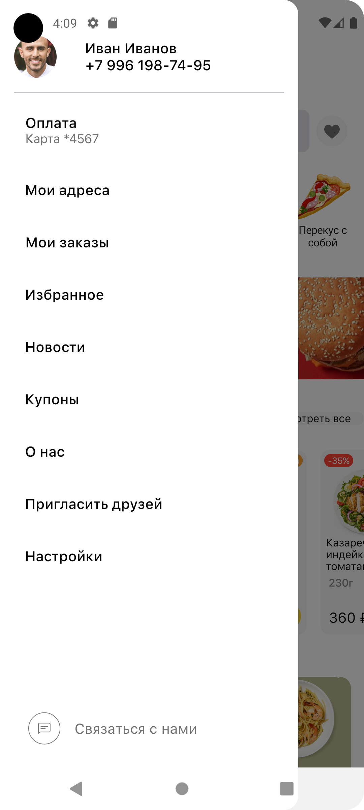

# ProdmoShopApp

### Screenshots / Скриншоты

- **Progress Screen / Экран прогресса**  
  

- **Add Words to Dictionary / Экран добавления слов в словарь**  
  

Настройка перед запуском

Перед сборкой и запуском проекта необходимо выполнить следующие шаги:

Создайте файл `` в корневой директории проекта (если он отсутствует).

Добавьте в local.properties API-ключ DaData:

DADATA_API_KEY=ваш_ключ_сюда

Важно! Убедитесь, что файл local.properties добавлен в .gitignore, чтобы API-ключ не попал в репозиторий.
