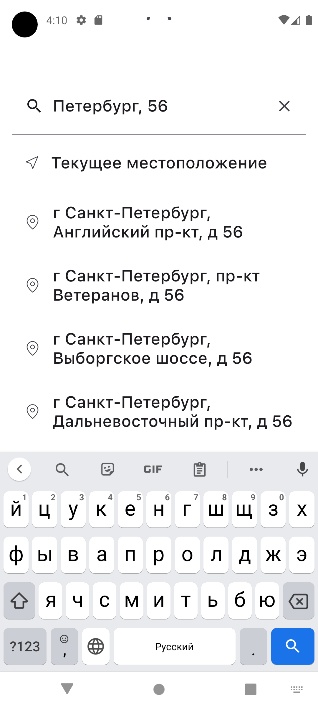

# PromoShop

### Screenshots / Скриншоты

- **Демо**  
  

- **Экран промо 1**  
  

- **Меню**  
    
- **Поиск адреса**  
  
- 
Настройка перед запуском

Перед сборкой и запуском проекта необходимо выполнить следующие шаги:

Создайте файл `` в корневой директории проекта (если он отсутствует).

Добавьте в local.properties API-ключ DaData:

DADATA_API_KEY=ваш_ключ_сюда

Важно! Убедитесь, что файл local.properties добавлен в .gitignore, чтобы API-ключ не попал в репозиторий.

### Используемые технологии

Jetpack Compose, Hilt, Retrofit, Material 3, Dadata Api